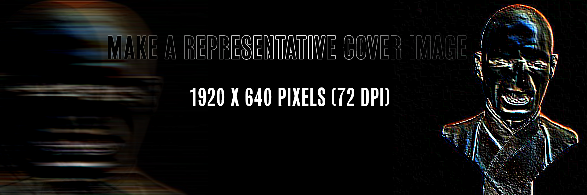

# TITLE HERE Example README.md Outline

### Table of Contents
1. [Artefact](#Artefact)
    1. [Metadata](#Metadata)
2. [Research](#Research-h1)
3. [Transcoding](#Transcoding)
    1. [Transcoding No. 1](#Transcoding-no-1)
    2. [Transcoding Tool](#Transcoding-tool)
4. [Reflection](#Reflection)
5. [Outcome](#Outcome)
6. [Conclusion](#Conclusion)
7. [Bibliography](#Bibliography)

# Artefact
A series of photographs of politicians giving speeches in various occasions and times. Search word in archive: toespraak.

## Metadata
| Tag | Data & Study |  
|--|--|
**IISG Call Number** | [IISG BG B19/640 ](https://hdl.handle.net/10622/EB99E5C9-7A39-4145-B64B-02C6AE7415B3)
| **Type** | Visual Documents
| **Medium** | Photo
| **Date & Location** | 1947 1 mei, Amsterdam
| **Subject Person** | Paul de Groot
|| <ul><li>fact: This photo was taken by Ben van Meerendonk on 1st May 1947 at May Fest in Olympic Stadion Amsterdam. It documents the moment of Paul de Groot giving speech inside the stadion on a tall stage in front of the audience.</li><li>photographical values: The body of the speaker only takes the top 1/5 of the whole picture. The tall stage takes up most of the space in the picture. The flash and the angle made its height and existence very pronounced.
There is a pattern of wrinkle on the bottom right corner of the photograph. It might be caused by any stretch and humidity. The wrinkle of the photograph itself almost synchronises with the folds on the fabric in the photograph.</li></ul>
**IISG Call Number** | [IISG BG B24/643 ](https://hdl.handle.net/10622/FD5D0CBB-EA09-48CA-8F4D-FC2632334266)
| **Type** | Visual Documents
| **Medium** | Photo
| **Date & Location** | 1932 21 marrt, Doorn
| **Subject Person** | Hendrik De Man
|| De man gave speech to SDSC.
**IISG Call Number** | [IISG BG B24/405 ](https://hdl.handle.net/10622/D6E46F32-F4E5-4A2F-8969-5E9E41245FF9)
| **Type** | Visual Documents
| **Medium** | Photo
| **Date & Location** | 1955, Vierhouten
| **Subject Person** | Willem Schermerhorn
|| Schermerhorn gave speech at AJC. Pinksterfeest.
**IISG Call Number** | [IISG BG A56/175  ](https://hdl.handle.net/10622/BFD29E58-30EE-4BB2-BF74-3FFCA1E61D63)
| **Type** | Visual Documents
| **Medium** | Photo
| **Date & Location** | 1955, Vierhouten
| **Subject Person** | Ad van Moock
|| Herzberg gave speech at AJC. Pinksterfeest.
**IISG Call Number** | [IISG BG A22/834  ](https://hdl.handle.net/10622/F13D740C-B058-4823-AE74-01E5CE27776D)
| **Type** | Visual Documents
| **Medium** | Photo
| **Date & Location** | -unknown-
| **Subject Person** | D Bakker
|| A portrait of D Bakker, collection of Willem Banning and Persfotobureau "Folkers".
**IISG Call Number** | [IISG BG B24/613  ](https://hdl.handle.net/10622/AEE57E74-B6C2-4377-B250-1E329A4D152C)
| **Type** | Visual Documents
| **Medium** | Photo
| **Date & Location** | -unknown-
| **Subject Person** | J.A.W Burger
|| A portrait of Burger giving speech at PvdA meeting.
**IISG Call Number** | [IISG BG A56/874-5  ](https://hdl.handle.net/10622/9DDA7438-438D-4E2E-9ECD-0D5D981AB7E4)
| **Type** | Visual Documents
| **Medium** | Photo
| **Date & Location** | -unknown-
| **Subject Person** | J.K.M Gevers
|| -no more information-
**IISG Call Number** | [IISG BG A62/733 ](https://hdl.handle.net/10622/D16A8D4B-F4B0-4B80-B96E-856E282C11E8)
| **Type** | Visual Documents
| **Medium** | Photo
| **Date & Location** | Ca. 1930, Amsterdam
| **Subject Person** | Koos Vorrink
|| Speech at the IJsclubterrein in Amsterdam.
**IISG Call Number** | [IISG BG B27/132-4 ](https://hdl.handle.net/10622/3301805F-B405-464A-9985-1456A0FDDACF)
| **Type** | Visual Documents
| **Medium** | Photo
| **Date & Location** | 1925-1949, Haarlem
| **Subject Person** | Louis de Visser
|| Louis de Visser gave speech for the Haarlem department
**IISG Call Number** | [IISG BG A63/14](https://hdl.handle.net/10622/C6273DE3-FCE5-433A-BC43-68DE6724EF82)
| **Type** | Visual Documents
| **Medium** | Photo
| **Date & Location** | 1930
| **Subject Person** | Theo van Driesten
|| -
**IISG Call Number** | [IISG BG A42/875](https://hdl.handle.net/10622/DEE61CA6-F947-4DDE-88D1-0B83D0CD7FD0)
| **Type** | Visual Documents
| **Medium** | Photo
| **Date & Location** | 1985 April 18, Bruxelles
| **Subject Person** | Willy Brandt
|| Speech of Brandt on the occasion of the 100th anniversary of the SP / PS.
**IISG Call Number** | [IISG BG B19/526 ](https://hdl.handle.net/10622/7AF0B08F-C4F3-4208-9CAF-681419A67B0B)
| **Type** | Visual Documents
| **Medium** | Photo
| **Date & Location** | 1947 8 September
| **Subject Person** | Sicco Manscholt
|| -
**IISG Call Number** | [IISG BG B29/27 ](https://hdl.handle.net/10622/87000F4C-FA69-4F44-A0AE-0ED359E24D87)
| **Type** | Visual Documents
| **Medium** | Photo
| **Date & Location** | 1947 7 September, Amersfoort
| **Subject Person** | Gerben Wagenaar
|| Speech of G. Wagenaar at Waarheid zomerfeest in Birkhoven.
**IISG Call Number** | [CSD BG B23/480](https://hdl.handle.net/10622/087DFBCD-DD99-43FB-8B69-180C10CED610)
| **Type** | Visual Documents
| **Medium** | Photo
| **Date & Location** | 1968 Decemember, Amsterdam
| **Subject Person** | G.H Veringa
|| Speech of Veringa in Maagdenhuis.
**IISG Call Number** | [IISG BG B26/391](https://hdl.handle.net/10622/5061FF8A-94DA-4219-B95F-A9E1B6398787)
| **Type** | Visual Documents
| **Medium** | Photo
| **Date & Location** |1969-1974, The Netherlands
| **Subject Person** | J Lanser
|| 	Toespraak Lanser tot de algemene vergadering.
# Research (H1)

This section consolidates the background research, context and any relevant information regarding your research **into** the artefact.

## Research Sub-Heading (H2)
Its important to give a clear structure to your Readme. Please use the document structure provided by markdown, so think of Headings, Sub-headings, text, bold/italic, lists (bullets and numbered), tables etc. You can also include some linked footnotes like this. [[1]](#footnote-1)

### Research Sub-sub-heading (H3)
The H3 heading is useful to define specific subsections within the H2 section. If you are in doubt about information structure, take a look at different wikipedia articles for reference.

# Transcoding
Please include a general description of the role of transcoding in your project. Using the H2 headings below, you can specify individual Transcoding experiments. Think about your motivations in transcoding, and mention the role of tools (also those made during the assignment). This gives some direction to the reader about what they will read in more detail below.

## Transcoding No. 1
### Description
Short description here. You can structure the information and documentation for each transcoding, design research or coding tool as you like. It's important that you make clear the aims & goals of the transcoding, what methods and tools you use. If this is often the same across different transcodings, consider making a standardised table at the beginning of each.

You should include well-formatted documentation of your experiments and developments below. Someone without previous knowledge about your work should be able to follow along the steps, aims and results of your developments from this structure. Make sure all media used is correctly linked or embedded (images, PDFs, Videos, etc).

### Methods
Description of your methods, documentation of behind-the-scenes processes can go here. Think of the photos and videos you made when visiting the IISG or during captures of your artefact. You can use tools such as [Gifs.com](https://gifs.com/) to generate moving-image thumbnail to link to short videos.Just enough to give a clear overview, before getting into details.  

With some HTML tags you can do simple styling in markdown, for example:

    <width="50%">

Remember to include the url link to jump to the full media, of course!

### Tools
Mention the tools that you used or made (if and when relevant).

### Results
Some of your transcoding experiments may have smaller outcome sketches like images or short video tests. They can go directly within this section. Or maybe this transcoding became a part of the final outcome format. When that is the case, you can simply include a [hyperlink](#) to the final outcomes in the **Transcoding** section. In the final outcome section below you can embed or explain the final format outcome in detail.  

## Transcoding Tool
### Description
You might have made multiple coding tools during the semester. Or the transcoding tool might be part of a specific transcoding experiment itself. It's up to you to define the linear flow of the Readme. Just like the transcoding of media itself, the coding tool should be well documented. So if you are using a coding tool in your first experiment, include the documentation of the coding tool **before** you include the results, etc.

### Aims
Include the main aims or intentions behind making the tool, and what it is used for.

### Methods
This includes the coding languages, coding frameworks or libraries, and any platforms or webtools for example.   

### Results
The coding tool will vary a lot between different students. So depending on the use and type, you may include more or less documentation here.

### Source Links
Please include links to the tools, sources etc used during the coding. E.g. the resources used for making your coding tool.  

# Reflection
You might want to include a section about reflecting on the results of your coding and IMD experiments this semester. It can give additional context before reading the final outcomes below.

# Outcomes
This section will be different for each student, depending on how and what is formatted as a final result for the semester assignment. Nevertheless a clear written and documented outcomes is important. So give the appropriate subsections or formats to make this as thorough as possible.

### Outcome Links
Here you link to your final assignment outcomes. This could be a website, a video, etc etc. Please include links to the appropriate GitHub folder on your repository where your coding tool is stored.

This is the main way to access your IMD + Coding outcomes for the semester. So its very important that you check for bugs, troubleshoot hyperlink issues, embedded media issues etc. Please make sure you KNOW where each file you use is stored. E.g. If you migrated from Notion markdown into GitHub, its **VERY IMPORTANT** to know that Notion randomly stores images on an Amazon server. It changes those locations all the time. So if your main outcome or documentation is still grabbing those links, **its very likely** they might disappear before collectives. So please have all media and necessary files managed well in your own locations (online or github etc).   

# Conclusion
You might have a nice conclusive observation to share at the end :)

## Bibliography
Of course, as with all research work please include a good bibliography with links, and any references that were used or might give additional depth to the work.

<a name="footnote-1">**[1]**</a>: Look at this little referenced footnote over here. You can look up different text formats for referencing books, online articles, films etc.
